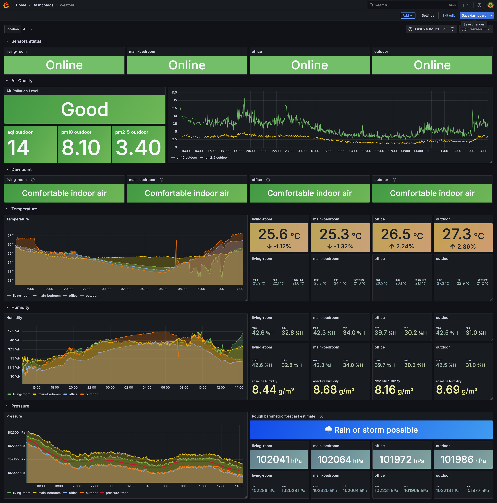

# Home lab setup using Talos, Kubernetes, Synology CSI, Gluetun, etc.

## Overview

A single node Kubernetes cluster setup on an Asus NUC 13 Pro i7 with the
following stack:

- cert-manager (LetsEncrypt)
- grafana
- nanomq (MQTT broker for IoT devices)
- influxdb (core v3 + explorer + telegraf)
- external-dns
- homeassistant
- otaflux (server new firmware to IoT devices)
- kubernetes-replicator (replicate secrets across namespaces)
- ingress-nginx
- jackett
- qbittorrent + gluetun VPN
- radarr
- sonarr
- synology-csi
- talos (Kubernetes)

## Getting started

### 1. Prepare secure boot image to start Talos on the machine (OSX)

```bash
# following image has secureboot enabled, include btrfs, iscsi-tools, mei,
# i915 and intel-ucode extensions.
# You can generate your own image from https://factory.talos.dev
wget https://factory.talos.dev/image/18fe771c6eccb97c798d475f038a98080dae33b68ade749caf16e3dfbda44f16/v1.10.1/metal-amd64-secureboot.iso

hdiutil convert -format UDRW -o metal-amd64-secureboot.img metal-amd64-secureboot.iso
mv metal-amd64-secureboot.img{.dmg,}

# plug the usb key, find the disk number
diskutil list

# use the path to the disk and change the command below accordingly
diskutil unmountDisk /dev/disk3
sudo dd if=metal-amd64-secureboot.img of=/dev/rdisk3 bs=1m
diskutil eject /dev/disk3
```

### 2. Prepare Kubernetes cluster

```bash
# following image has secureboot enabled, include btrfs, iscsi-tools, mei,
# i915 and intel-ucode extensions.
# You can generate your own image from https://factory.talos.dev
export TALOS_FACTORY_IMAGE_INSTALLER=factory.talos.dev/installer-secureboot/18fe771c6eccb97c798d475f038a98080dae33b68ade749caf16e3dfbda44f16:v1.10.1

export MACHINE_IP=192.168.94.254

# check which disk are available on the machine, then update the
# talos/tpm-disk-encryption.yaml file accordingly
talosctl -n "$MACHINE_IP" --talosconfig=talosconfig disks

# generate talos config
talosctl gen config homie "https://${MACHINE_IP}:6443" \
  --install-image "$TALOS_FACTORY_IMAGE_INSTALLER" \
  --config-patch @talos/tpm-disk-encryption.yaml

talosctl -n "$MACHINE_IP" apply-config \
  --insecure \
  -f controlplane.yaml

# generate kubeconfig
talosctl -n "$MACHINE_IP" --talosconfig=talosconfig kubeconfig
```

### 3. Install cluster apps

Make appropriate patches to ingresses/secrets. Then:

```bash
# apply kubernetes config using Kustomize
kustomize build --enable-helm clusters/homie | kubectl apply -f -
```

Notes: while formatting the disk on the first run, the associated pod will stay in a
ContainerCreating state for a while depending on the disk size.

## Cluster upgrade

### Talos upgrade

```bash
# following image has secureboot enabled, include btrfs, iscsi-tools, mei,
# i915 and intel-ucode extensions.
# https://factory.talos.dev
export TALOS_FACTORY_IMAGE_INSTALLER=factory.talos.dev/installer-secureboot/18fe771c6eccb97c798d475f038a98080dae33b68ade749caf16e3dfbda44f16:v1.10.1

export MACHINE_IP=192.168.94.254

talosctl upgrade \
  -n "$MACHINE_IP" \
  --talosconfig=talosconfig \
  --image "$TALOS_FACTORY_IMAGE_INSTALLER" \
  --preserve

talosctl apply-config \
  -n "$MACHINE_IP" \
  --talosconfig=talosconfig \
  --insecure \
  -f controlplane.yaml
```

### Kubernetes

```bash
export MACHINE_IP=192.168.94.254
export KUBERNETES_VERSION=1.33.0

talosctl upgrade-k8s \
  -n "$MACHINE_IP" \
  --talosconfig=talosconfig \
  --to "$KUBERNETES_VERSION"
```

### 4. Testing

Make sure the VPN is not leaking your IP by downloading the IP Leak torrent
magnet from https://ipleak.net.
The IP will be disclosed in the description.

## Home sensors

The home contains various ESP32 DevKit v1 based sensors (BME280, SCD30, SDS011,
etc.), which measure various metrics such as temperature, humidity and
pressure.

Measurements are sent to NanoMQ using the MQTTv5 protocol over TLS. Telegraf
then subscribe to the sensors topics and store the metrics into InfluxDB.
Grafana is used for dashboarding.

For more information regarding the ESP32 implementation, refer to the
[etiennetremel/esp32-home-sensor][esp32] repository.



<!-- page links -->
[esp32]: https://github.com/etiennetremel/esp32-home-sensor
